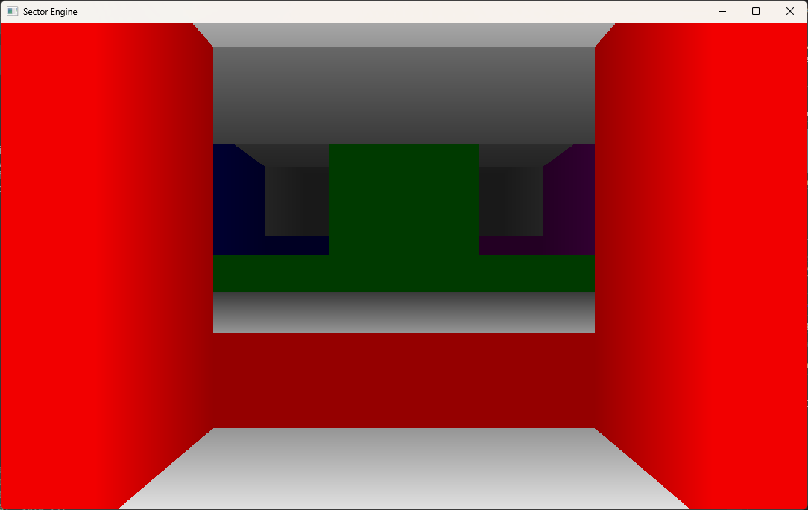

# Sector Engine

A WIP project of mine to create a doom/build engine style 3D renderer. 

## Todo for initial demo: 
- [X] Basic rendering of colored walls
- [X] Fix coordinate system jankiness
    - [X] Make player and world behave in the same coordinate system. 
- [X] Rendering of colored floors/ceilings with simple geometry
- [X] Rendering of colored floors/ceilings with holes
- [ ] Basic collision code
    - [ ] User collides with solid walls
    - [ ] User can pass through portals that have the same or lower floor height
    - [ ] User can step up to a certain height          
- [ ] Rendering of textured walls
    - [ ] Textures loaded from disk
    - [ ] Textures default scale: 1px per map unit
    - [ ] Textures can be scaled
    - [ ] Textures can be rotated
    - [ ] Textures can be skewed
- [ ] Rendering of textured floors/ceilings
    - [ ] Textures loaded from disk
    - [ ] Textures default scale: 1px per map unit
    - [ ] Textures can be scaled
    - [ ] Textures can be rotated
    - [ ] Textures can be skewed
- [ ] Loading maps from Doom Wads
    - [ ] Convert to internal map format
    - [ ] They render correctly, but map functionality won't be there.
- [ ] Billboarded Sprites:
    - [ ] Single angle sprites face player 100% of the time
    - [ ] 8-angle sprites like doom monsters

## Building

Building requires both CMake and Vcpkg. 
